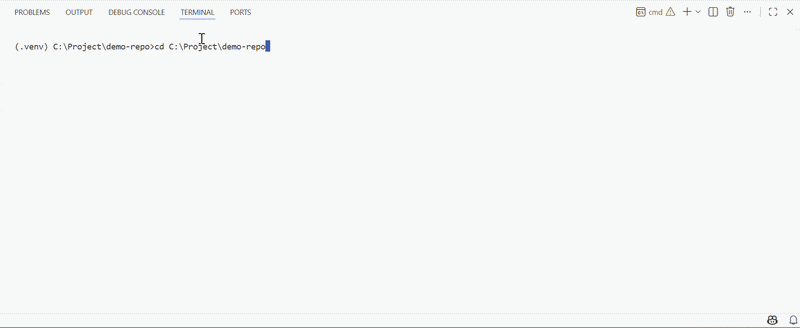

# ReproPilot

**A static reproducibility linter for ML repositories.**

Run `repropilot check .` to see whether another person can actually understand your data, environment, training command, evaluation flow, and saved results — before they waste an afternoon trying to run your repo.

[](https://github.com/Antai-Liu/repropilot/actions)
[](https://github.com/Antai-Liu/repropilot)
[](LICENSE)



---

## Why?

Many ML repositories fail to run for boring reasons:

- no clear dataset source or split policy
- missing or undocumented train/eval command
- unpinned dependencies
- random seed never set
- metrics saved without the config that produced them
- README says "run train.py" but the repo doesn't actually run

ReproPilot catches these before reviewers, collaborators, or future-you hit them.

---

## Quickstart

```bash
pip install repropilot
repropilot check .
```

That's it for an existing repo. To scaffold a clean starter:

```bash
repropilot init my-project --task image-classification
cd my-project
python src/train.py   # CPU smoke test on synthetic data
```

---

## What it checks

Point it at a Python/PyTorch-style ML repository and get a hygiene score, a categorised pass/fail breakdown, and an ordered list of failed checks with fixes.
Reproducibility Hygiene Score: 72/100  (static audit)

Static audit only: this does not prove your results reproduce.

It checks whether the repo contains the minimum information needed to attempt reproduction.
A. Onboarding & Environment  16/20   ✓ README  ✓ requirements  ✗ hardware notes

B. Data Transparency          9/20   ✗ no dataset instructions  ✗ no split policy

C. Config & Determinism      15/20   ✓ config file  ✗ random seed not set

D. Train/Eval Workflow       18/20   ✓ train.py  ✓ eval.py  ✓ CI

E. Results & Traceability    14/20   ✓ metrics.json  ✗ no run config saved
Top fixes:

Add DATA.md with dataset source and split policy.
Set Python/NumPy/PyTorch seeds via set_seed() in src/train.py.
Save run configuration to outputs/run_config.yaml.


---

## How the score is computed

The default score is **rule-based and transparent** — no model, no black box:

- **Environment** — dependency files, Python version, hardware notes
- **Data** — dataset source, preprocessing, split policy
- **Determinism** — seed handling, config files, saved run settings
- **Workflow** — train/eval commands, smoke test, CI
- **Traceability** — metrics, logs, checkpoints, experiment artifacts

Every check returns:
data.missing_splits_doc

Severity: high

Why:  Reported metrics are hard to interpret without knowing the train/val/test split.

Fix:  Add DATA.md with split source, ratio, seed, and whether it's public or custom.

By default ReproPilot does **not** run your code. To also check whether documented commands start:

```bash
repropilot check . --run-smoke-test
```

Smoke-test mode runs the configured commands with a timeout on CPU. It does **not** attempt to reproduce reported metrics.

---

## What the score does and does not mean

ReproPilot does **not** prove that a paper's reported numbers are reproducible.

It checks whether the repository gives another person a **fair chance** to reproduce the work: environment, data instructions, configs, seeds, train/eval commands, CI, metrics, and saved run metadata.

Think of it like `ruff` for ML reproducibility hygiene — it catches missing structure and documentation, not scientific mistakes.

---

## Use it in CI

Add one workflow snippet and every PR can receive a score comment, the failed rule list, and suggested fixes:

```yaml
- uses: repropilot/repropilot-action@v0.1
  with:
    fail-under: 70
    comment-on-pr: true
    write-badge: true
```

The PR comment looks like:
ReproPilot: 68/100 — below threshold (70)
Failed:

data.missing_dataset_doc: Add DATA.md with dataset source and split policy.
determinism.no_seed:       Set Python/NumPy/PyTorch seeds.
traceability.no_run_config: Save run config to outputs/run_config.yaml.


---

## README badge

Badge files are committed to your repo, so no hosted service is required:

```markdown
<!-- Option 1: static SVG committed to the repo -->


<!-- Option 2: shields.io endpoint backed by a JSON file in the repo -->

```

The badge keeps working even with no hosted backend.

---

## Pre-commit hook

Run the check before every commit:

```yaml
repos:
  - repo: https://github.com/Antai-Liu/repropilot
    rev: v0.1.0
    hooks:
      - id: repropilot-check
        args: ["--fail-under", "70"]
```

---

## PyTorch starter

`repropilot init` scaffolds a small PyTorch repo that passes ReproPilot's default checks. It includes synthetic data, a CPU smoke test, config files, metrics output, and DATA.md placeholders — a working example of what a clean repo looks like.

```bash
repropilot init my-project --task image-classification
# also available: --task fake-image-detection  (visual demo with a confusion matrix)
```

Synthetic data is used only to verify the train/eval pipeline runs. Real datasets are documented in DATA.md.

---

## Comparison

| Tool | Main focus | Difference |
|---|---|---|
| Cookiecutter Data Science | Project scaffolding | ReproPilot audits existing repos and produces a score/badge |
| victoresque/pytorch-template | Training framework/template | ReproPilot is framework-light and focuses on reproducibility checks |
| Paper2Code / PaperCoder | Generate code from papers | ReproPilot doesn't implement papers; it audits repo hygiene |
| ruff / pre-commit | Code quality checks | ReproPilot plugs into the same workflow for ML repo hygiene |

---

## Roadmap

**v0.1** — static check · PyTorch starter · GitHub Action · README badge · pre-commit hook

**v0.2** — rule IDs and configurable weights · better framework detection · GitHub annotations · HTML/Markdown report output

**v0.3** — smoke-test improvements · dataset documentation templates · experiment artifact checks

**Later** — hosted badge endpoint · web report viewer · optional natural-language explanations for failed rules

---

## Contributing

See [CONTRIBUTING.md](CONTRIBUTING.md). All PRs run `repropilot check` on themselves.
